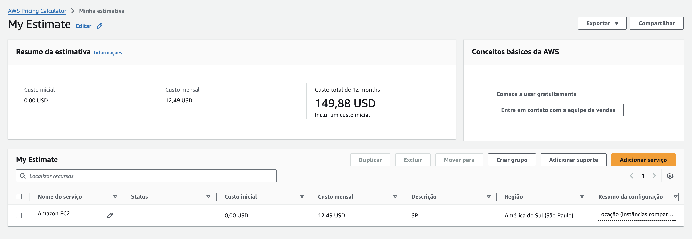
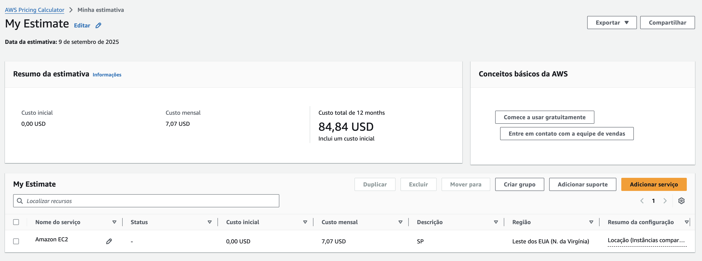

# Fase 5 – FIAP | FarmTech Solutions 🌱

O objetivo foi analisar dados climáticos e de cultura agrícola de uma fazenda de médio porte, explorando padrões e construindo modelos preditivos para estimar o rendimento da safra.

---

## 📂 Estrutura do Repositório
- `data/crop_yield.csv` → base de dados utilizada no projeto
- `notebooks/NomeCompleto_rmXXXXX_pbl_fase4.ipynb` → notebook com todo o passo a passo (EDA, clusterização, modelos preditivos e conclusões)
- `requirements.txt` → dependências necessárias para execução
- `README.md` → documentação introdutória do projeto

---

## 🚀 Como Executar
1. Clone este repositório  
   ```bash
   git clone https://github.com/SEU-USUARIO/fase5-fiap-farmtech.git
   cd fase5-fiap-farmtech
   ```

2. Instale as dependências  
   ```bash
   pip install -r requirements.txt
   ```

3. Abra o Jupyter Notebook e execute:  
   ```bash
   jupyter notebook notebooks/ItaloDomingues_rm561787_pbl_fase4.ipynb
   ```

---

## 🎥 Demonstração em Vídeo
[Link para o vídeo no YouTube (não listado)](https://youtu.be/qkmm0qfMbco)

---

## 👨‍💻 Integrantes do Grupo
- Italo Domingues – RM: 561787
- Maison Wendrel Bezerra Ramos – RM: 565616

## ☁️ Entrega 2 – Computação em Nuvem (AWS)

Nesta etapa, foi utilizada a **AWS Pricing Calculator** para estimar custos de uma instância com as seguintes configurações:

- 2 vCPUs
- 1 GiB de memória
- Até 5 Gbps de rede
- 50 GB de armazenamento EBS (HD)
- Linux, On-Demand (100%)

### 📊 Comparação de custos

| Região              | Custo Mensal Estimado |
|---------------------|-----------------------|
| São Paulo (BR)      | US$ 12,49             |
| Virgínia do Norte   | US$ 7.07              |

*(valores retirados da AWS Pricing Calculator, imagens abaixo)*

  


### 💡 Conclusão de custo
- A região **Virgínia do Norte (EUA)** apresentou custo **mais baixo**.
- Entretanto, a diferença não é tão grande quando comparado ao custo Brasil.

### ⚖️ Restrições legais e decisão
Devido à exigência de manter dados **dentro do Brasil**, a opção escolhida é a região **São Paulo (South America)**, mesmo com custo um pouco maior.  
Essa escolha garante conformidade legal e menor latência de acesso aos sensores locais.

---

## 🎥 Demonstração em Vídeo (Entrega 2)
[Assista ao vídeo no YouTube (não listado)](https://youtu.be/Kr1-dgsiDvM)